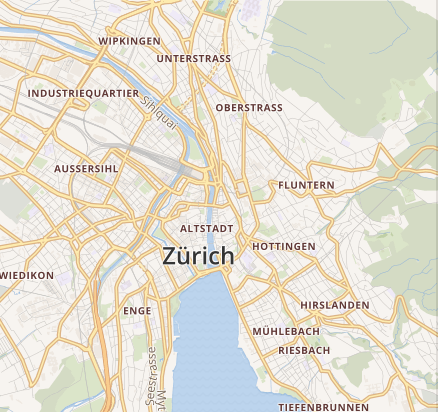

# Rust Pixel Diff

- A Rust pixel diffing implementation for finding the difference in pixels between two `png` images.

## Quickstart
1. Clone this repository.
2. Two starting images are provided in the `tests` directory; **4a.png** and **4b.png**.
3. While in the root directory, run `cargo run -- --first-image ./tests/4a.png --second-image ./tests/4b.png --output-dir ./tests --threshold 0.1`.
4. In the **tests** directory a new file will be created called `output.png`; this shows the pixel difference between the two images provided.

## Command Line Args
- `-f` or `--first-image <string>` - The file path to the first image.
- `-s` or `--second-image <string>` - The file path to the second image.
- `-o` or `--output-dir <string>` - The file path where the output file should be placed.
- `-t` or `--threshold <f64>` - A value between 0 (inclusive) and 1 (exclusive). A lower value means the the algorithm will be more sensitive to changes in pixel colors between the two images. The largest variation in sensitivity will be found on [0, 0.1]. **Defaults to .1**.

Implements ideas from the following papers and is based on the Javascript library [pixelmatch](https://github.com/mapbox/pixelmatch):

- [Measuring perceived color difference using YIQ NTSC transmission color space in mobile applications](http://www.progmat.uaem.mx:8080/artVol2Num2/Articulo3Vol2Num2.pdf) (2010, Yuriy Kotsarenko, Fernando Ramos)
- [Anti-aliased pixel and intensity slope detector](https://www.researchgate.net/publication/234126755_Anti-aliased_Pixel_and_Intensity_Slope_Detector) (2009, Vytautas Vyšniauskas)

## Example output

| expected | actual | diff - threshold = 0.05 |
| --- | --- | --- |
|  |  |  |